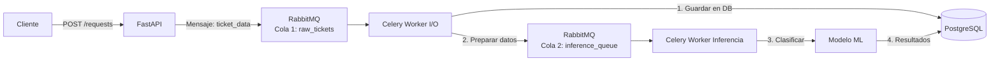
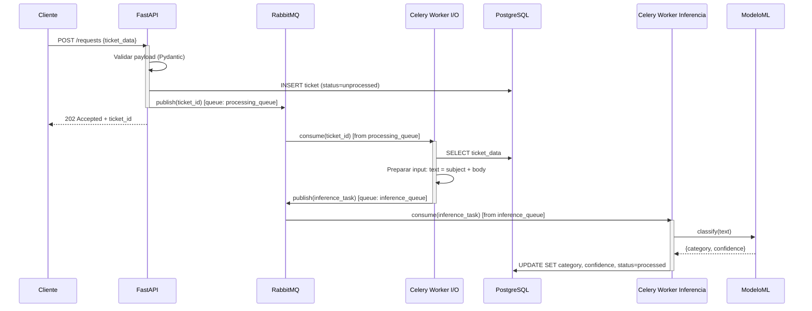

## Overview

For this demo, it was designed and implemented and async architecture in order to process Datasets and Make inference
in the data from the dataset.

In this demo, I focus mainly in architecture, distributed system and integrate a ML pipeline instead train models,
clean architectures or avoid data leakage etc.

For this demo are deployed in a docker-compose:

    -celery workers
    -Redis(acts as backend for RabbitMQ)
    -RabbitMQ
    -API
    -PostgresDB

Everything is deployed in an isolated docker container.
later in this document it will be explained the components and the architectural decision.

## Local SetUp instructions

### Prerequesites

This project needs docker >= 20 and docker-compose >= 1.29. Installation.

Also needs `make` in order to execute make commands (make acts like an orchestrator for local setUp)

Ensure to have installed the prerequisites in your local environment.

### Optional.

Docker-desktop. I know that is not as stable like using the CLI, but I'm pro GUI (graphic interfaces), so helps a lot.

----------------------

### Build

Run this before you run any other make commands to ensure you have build the images.

```sh
make build
```

### Run

```sh
make up
```

### Test

Before running tests remember to build the project.


```sh
make test
```

### Finish

```sh
make down
```

### Architecture

As was mentioned before, for this project is used Message broker and queues (RabbitMQ), consumers (celery workers),
API (fastAPI), broker-backend (Redis) and DB (PostgresSQL).

The complete flow you can check in the next diagrams:

```mermaid
graph TD
    subgraph API FastAPI
        A1["POST /requests<br/>(new ticket)"] --> C1["send_task:<br/>process_new_ticket"]
        A2["POST /seed"] --> C2["send_task:<br/>seed_database"]
        A3["POST /process-tickets"] --> C3["send_task:<br/>process_existing_ticket"]
        A4["GET /requests/{id}"] --> C4["send_task:<br/>fetch_record"]
        A5["GET /requests?category=..."] --> C5["send_task:<br/>filter_by_category"]
        A6["GET /status/{task_id}"] --> C6["AsyncResult lookup"]
    end

    subgraph Celery Broker (RabbitMQ)
        C1 --> Q1["ticket_queue"]
        C2 --> Q1
        C3 --> Q1
        C4 --> Q1
        C5 --> Q1
        C7["send_task:<br/>run_inference"] --> Q2["inference_queue"]
    end

    subgraph Worker ticket_worker
        Q1 --> W1["process_new_ticket"]
        Q1 --> W2["seed_database"]
        Q1 --> W3["process_existing_ticket"]
        Q1 --> W4["fetch_record"]
        Q1 --> W5["filter_by_category"]
        W1 --> C7
    end

    subgraph Worker inference_worker
        Q2 --> W6["run_inference"]
        W6 --> DB1[(PostgreSQL)]
    end

    subgraph Database
        DB1[(PostgreSQL)]
    end

    style API FastAPI fill:#e0f7fa,stroke:#00796b
    style Celery Broker (RabbitMQ) fill:#f1f8e9,stroke:#689f38
    style Worker ticket_worker fill:#fff3e0,stroke:#f57c00
    style Worker inference_worker fill:#fce4ec,stroke:#c2185b
    style Database fill:#ede7f6,stroke:#512da8

```





As you can see, the flow is basically:

API -> RabbitMQ Ticket -> celery worker ticker -> RabbitMQ inference -> Celery inference.

- The API sends messages to the queue (ticket queue)
- Those messages in the queue are consumed by a worker (ticket worker)
- Worker (ticket worker) store data in the Db and send a message to another queue (inference queue)
- Worker (inference worker), consumes messages for the queue (inference queue)
- Worker (inference worker), makes the inference and store results in the DB (In fact execute a bit more tasks)

The reason of this is separate responsibilities and scalability. Also, I was looking for an async solution that could scale and process large datasets.

I will explore this in deep in Implementation  and why this? sections.

# How to use this project?

After execute the `make` commands I recommend to make this:

### seed.

In postman or using curls or using your preffered tool, make a request to:

`POST http://localhost:5000/seed`

This endpoint will copy the data from the data set into the DB.

After that execute:

### process-data
`POST http://localhost:5000/process-tickets`
with the payload:

```
{
    "batch_size": 2000
}
```
This will process the data from the db that hasn't processed before and make the inference.

### Process new ticket.

`POST http://localhost:5000/requests`

with a payload like this:


```
{
  "subject": "Error in billing system",
  "body": "Clients report that they cannot download their invoices when their press the download button in the billing portal",
  "priority": "High"
}
```

This will create a new record from scratch that is not presented in the dataset. Store the result in the DB.

### Fetch a ticket:

`GET http://localhost:5000/requests/{id}`

This return a payload with the `task_id`. The reason of this is because we are using the queue and workers to execute this in async mode.
In a real scenario this doesn't have sense, but for this demo I made like this. (Explanation of this in why this? section)

with the `task_id`, make another request to:

`GET http://localhost:5000/status/{task_id}`

This return the proper ticket.

### Filter tickets.

Similar to fetch a single ticket:


`GET http://localhost:5000/requests?category=technical`

With the `task_id`, make another request:

`GET http://localhost:5000/status/{task_id}`

----------------------------------

# Implementation.

As I mentioned in the overview, for this demo, I focus mainly in the architecture, in how to process efficient datasets
and make inferences on the data.

To do this, I designed the architecture that is above and in order to implement it, I designed a distributed system (for this demo, deployed in a docker compose. For a real project,
this will be deployed in a cluster like Kubernetes or AWS ECS fargate). In this distributed system, everything is deply in isolated containers,
It was deployed

## APi.

This is just an API that contains the next endpoints:

- `POST /seed` -> Seed the DB, Upload the data from the dataset to the DB.
- `POST /requests` -> Process new tickets that are not seed with `POST /seed`. Tickets that are not from the dataset. Make the inference.
- `GET /requests/{id}` -> Fetch a specific record from the DB on base id.
- `GET /requests?category={something}` -> Accepts query param and filter on base category.
- `GET /status/task_id `-> Check the status of an Async task.
- `POST /process-tickets` -> Process the tickets form the dataset that are seed in the DB with `POST /seed`. Make the inference for the tickets in the DB from the dataset

Probably you have questions about, why `/seed`, why `/process-tickets`, why `/status/task_id`

I'll try to cover and answer the potential questions in section why this?

The container for the API is exposed in the port 5000.

## RabbitMQ (Message_broker)

As message broker I choose a RabbitMQ with two queues (apart from default queues that are provisioned with celery):

- `ticket_queue`
- `inference_queue`

Why those queues or why RabbitMQ? Answers in why this? section.

## Celery workers.

Celery is the official consumer of RabbitMQ and has a native integration with it, so makes sense to use celery workers as consumer.

It was implemented two celery workers:

- `ticket_worker` -> in charge to process the data.
- `inference_worker` -> in charge to make mainly the inference.

Both workers are deployed in separated an isolated containers.

The reason of this is have fully decoupled of both process and scale independently.

I expand this in why this? section.

# ticket_worker:

It's the worker for process data and execute mainly I/O operations. For that reason the worker use multithreading, in this
case, native threads (threads handle by the OS). This worker is mainly in charge to upload the dataset into the DB (I/O operation)

The worker has different tasks (check the `/ticket_worker/worker.py`) and also fetch the data using batches (check `database.py`)

For memory optimization store the data fetch in a list per batches that is good for small - medium datasets. For large datasets is developed
a generator (currently is not used but can be used)

# inference_worker.

The worker in charge of inference. When the image is build, the docker context download the CSV and make a basi training of a model in
`sckit-learn` and store the pretrain model in the same container.

The CSV used for make the classification is the same that was used for train the model. This of course leads a data leakage and is bac practice in 
a real scenario. I've used this for simplicity and because the idea fo this is shows the ML pipeline.

For a real scenario we need to use a pretrain model for GPT for example o Pytorch or something similar. Or train our own model 
but using a different CSV.

Is deployed in a docker container isolated, using the cpu for process (for this light model is fine), for a heavy model, we need to use parallelism
probably using the GPU cores using CUDA.

Also, for large model needs to be implemented the Dataloader to charge the data into the model for the inference. And probably isolate
the load and charge of model in a separate class (improvements that we can do)


## Redis (celery_backend)

Redis acts just as the backend for the message broker, it's pretty common to use it for this.

## PostgresDB.

The DB to store the dataset, the result of the inference and new tickets also. Both workers are able to write in this DB.
It was implemented a schema for the DB using the file `src/database/sql/init.sql` (check for details)

The Postgres db is deployed in an Isolated container. The container is exposed in the `host-port 5432` (the postgres default one)
and like that you can use pg-admin or Data-grip (my favorite one) to explore the DB.


-------------------------------------


# Why this?


## Why have endpoints like /seed or /status?

Basically, `/seed` are in charge to upload the dataset unto the DB. Is in charge to trigger this action. But why?

Basically the idea was to take advantage of the distributed system that was implemented for this demo and the async tasks to improve the performance of upload data.

The dataset used is relative small, but imagine something with hundred thousands or millions of rows. So, the idea was tu take adventage of the infra already setUp.

In a prod scneario this taks can be triggere using an SDK or CLI command in order to avoid lattency issues, but fot this demo I consider is ok have this endpoint.

And what about `/status/task_id`?

When you made a requests to the endpoint `GET /requests/{id}`, you will get the `task_id`, that is the id of the task that celery is executed. 
So, in order to get the proper ticket, you need to make a second request to `GET /status/ticket_id` using the `ticket_id` Ok, but why use a celery worker for this and complex a simple request?

Well, similar reason, take advantage of the infra already provisioned. The API container doesn't have access to the DB and I didn't want to expend more time to configure again the engine DB in the API container,
for this demo makes sense to use the existing infra and the workers already have access to the DB, So I just take advantage of this.

In a real scenario, GET a record from the DB is mainly a synch process, so in a real scenario the API container will have access to the DB. But for this demo, lets do like this.

## What about /process-ticket and POST /requests?

I mentioned this before, but /process-tickets process the data from the dataset that is stored in the DB and POST /request for a new ticket.

Basically I think that the data from the dataset is mainly for training, so I would need another endpoint for new data.

so why two endpoint both makes similar things?

Well, yes this true and probably there are some duplicate code (again, I focus mainly in architecture, this for sure needs to be refactored)
but the idea of this was had separate responsibilities. But this could be refactored for a real application.

## Why two workers isolated and two queues?

The reason of this in mainly for scalability.

The idea is separate the process of data process and inference process.

The reason of this is that data process in this context is mainly I/O operations. 

For the inference process its true that if you use a pretrained model, probably the operation is I/O. But this is valid for light models (like here that I made a basic training for a model using scikit-learn)
but, for large models (some of GPT for example), this operation is more CPU bound. So, in this context is worth to separate the responsibilities.

Having workers independent between them, allows to scale only the worker that you need and avoid bottlenecks.

Similar thing with the queues. Having separate queues for each worker, allows to access to the metrics of the queue (like length of the queue o latency queue) and in base of them decide scale in or scale out the workers.
If we use the same queue (that is viable) this scalability of the workers could be more complex.


## why using the same CSV for training and making predictions?

If you check the demo, the inference_worker train a scikit-learn model using the hugging face CSV. and then use the same CSV to make predictions.

This of course cause data leakage, is not a good practice I know. But as I mentioned before, this is just a demo and I focussed mainly in the architecture of the ML pipeline.

I could use another pretrain model but I just wanted something light for this demo.

In a real scenario we need to use a large pretrain model or train our own model but with another dataset.

## why rabbitMQ?

First for practicity. Configure a RabbitMQ as message broker is much simpler that configure another broker like kafka.

Second, the data is mainly static, so a protocol in base of queues is really good for this. For stream data, the solution will require something similar to kafka.
But for now and for this demo this works well.

Disadvantage of RabbitMQ is horizontal scalability of the queue, but for now I think is not a problem this (even in a real scenario in cloud we can use AWS SQS that scales in theory "infinite")


## why fetch a single record is something Async?

I mentioned this before but is mainly for this demo and use the existing infra. Mainly that. In real scenario the API needs to have access into the DB.

## Why of this architecture?

This distributed system is mainly thinking in scalability of the solution for process large datasets. The idea is scale workers when is needed.


-----------------

# How to improve it?

The workers have som values by default. For example for `ticket_worker` I set up by default 2 instances of this and by default
each instance has 8 threads.

Using multiple threads here works because both tasks are mainly I/O operations (consult a DB and upload in a S3 bucket). Celery handle in background the threads and in python
multythreading for I/O operations is fine (it's a problem for CPU bound operations and real parallelism base on threads)


```
ticket_worker:
    build: ./src/workers/ticket
    env_file:
      - 'variables.env'
    environment:
      - BUCKET_NAME=fashion-tasks
      - DATA_FOLDER=data
      - CELERY_WORKER_CONCURRENCY=8
    links:
      - backend:backend
      - broker:broker
      - database:database
    depends_on:
      - broker
      - backend
      - database
    networks:
      - network
    command: celery -A worker.imagery worker -P threads --loglevel=INFO --queues=ticket_queue
```

This works good, but for an optimize solution (and also a cost-efficient) this needs to scale on base of metrics.

In a real scenario, the relevant metrics for this would be `length of the queue`, `latency of the queue` and probably `memory`,

In base of this metrics we decided if scale in or out.

------------

Similar way to inference worker. I've set up  using some values by default. But the decision to scale should be on base of
queue metrics.

Also, I'm making the inference using CPU, that for this demo is fine, since we are using a model sckit-learn model using CPU is fine.
For large models we need to use heavi parallelism using CUDA for example to take advantage te cores of the GPU.

-----------------

The container API needs to have access to the DB.


------------------

The answers for filter all the records needs to be paginated to don't overload the client.


------------------

Another improvement that I implemented was make Batch processing im `database.py`, basically we consult the DB in batches.

Improve the indexes in the DB, try to partition the DB by categories and optimize the configuration of the DB:
```
CREATE INDEX CONCURRENTLY {index} ON TABLE USING BRIN (categories);
CREATE INDEX CONCURRENTLY {index} ON TABLE USING GIN (Something);
CREATE UNIQUE INDEX CONCURRENTLY idx_ticket_id ON TABLE (TICKET_id) INCLUDE (master_category, sub_category);

ALTER TABLE products SET (
    autovacuum_vacuum_scale_factor = 0,
    autovacuum_vacuum_threshold = 10000,
    autovacuum_analyze_scale_factor = 0,
    autovacuum_analyze_threshold = 20000
); 

# To implement this we need to make test, so I didn't implement in the code.
```

However, to improve the performance of this could be implement pagination in the responses of teh DB


# More improvements

2. We can implement pagination in the endpoints response and fetching the data in the DB
3. Can be explored compress metadata.
4. The inference worker  can process by batches if is needed.
5. we can implement memoization to cache frequent queries using cachetools for example and cache the S3 connections.
7. In a real project the workers will be in a cluster (like kubernetes or ECS), so apply load balancers.
8. Dataset Sharding (is complex to implement but can be explored)

and etc.

----------------------

In order to use a large pre-train model, is needed to implement a dataloader:
```
loader = DataLoader(
    dataset,
    batch_size=int(os.getenv("BATCH_SIZE", 64)),  # Aumentar batch size
    num_workers=int(os.getenv("NUM_WORKERS", os.cpu_count() // 2)),  # Usar 50% de los cores
    pin_memory=True,  # Better GPU transfer.
    prefetch_factor=3,
    persistent_workers=True,
    multiprocessing_context='fork' if os.name != 'nt' else 'spawn'
)
```


Using CUDA.

--------------------

## What is missing?

- Tests
- Alembic Migrations
- Refactor code, this is a naive implementation.

## Code Refactor

For scalabality of the code and easier maintain, could be beneficial implement and refactor the code strucure implemmenting some patters,
for example follow clean architechture pattern and principles, Isolating the businnes logic from external resources like API,
message brokers, DBs, Redis, Workers, in gneral any external infraestructure.


This is a bit complex and tedious to implement, however could be some advantages if is implemented a clean architecture
(we can explore more patterns).

Its simpler write unittest, specially for the business logic. Taking into account that everything is isolated and core business doesn't
depend on  external resources, is simpler write unittest because you don't have to deal with external dependencies. Just test the pure business logic.

Taking into account that in core business, `use_cases` doesn't depend of concrete implementations (depends on `ABS classes`),
change dependencies are simpler. For example, if we want to change `RabbitMQ `for `Kafka`, we only need implement `Kafka` and inject 
the `ABS class` to the `use_case` (remember, use_case depends on interfaces not concrete implementations.) We don't need to change nothing in the logic business.

Or if we want to migrate everything for a serverless, and use `AWS Lambda`, `AWS kinesis`, instead of `Celery` and `RabbitMQ`,
again is just inject the corresponding `ABS classes` and implement them.

And also if we use microservice is easier to scale them.

Again, this is a bit complex to implement, but in some cases could be worth.
